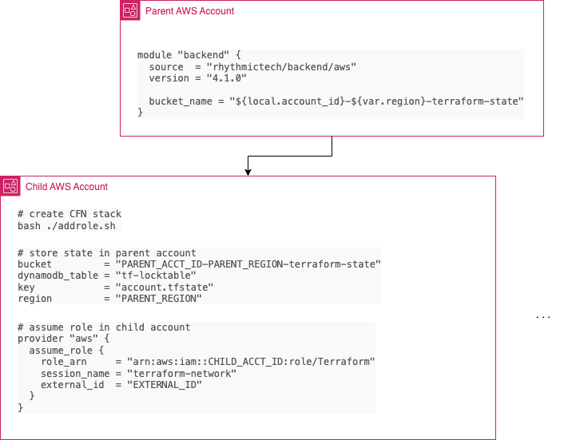

# terraform-aws-backend

[](https://github.com/rhythmictech/terraform-aws-backend/actions?query=workflow%3Atflint+event%3Apush+branch%3Amaster)
[](https://github.com/rhythmictech/terraform-aws-backend/actions?query=workflow%3Atfsec+event%3Apush+branch%3Amaster)
[](https://github.com/rhythmictech/terraform-aws-backend/actions?query=workflow%3Ayamllint+event%3Apush+branch%3Amaster)
[](https://github.com/rhythmictech/terraform-aws-backend/actions?query=workflow%3Amisspell+event%3Apush+branch%3Amaster)
[](https://github.com/rhythmictech/terraform-aws-backend/actions?query=workflow%3Apre-commit-check+event%3Apush+branch%3Amaster)
<a href="https://twitter.com/intent/follow?screen_name=RhythmicTech"></a>

Creates an S3 bucket and DynamoDB table for managing Terraform state. Note that when bootstrapping a new environment, it is typically easier to use a separate method for creating the bucket and lock table, like [a CloudFormation Stack](https://github.com/rhythmictech/AWS-CFN-Terraform-Bootstrap). This module is intended to create a backend in an AWS account that is already Terraform-managed. This is useful to store the state for other accounts externally.

This module will create a CloudFormation stack and an optional wrapper script to deploy it. This stack is suitable to run in any account that will store its Terraform state in the bucket created by this module. It creates an IAM role with the AdministratorAccess policy attached and with an External ID which can then be assumed by terraform to create resources in the child account(s).



*Breaking Changes*

Previous versions of this module had support for cross-account management in a way that proved awkward for many uses cases and made it more difficult than it should've to fully secure the tfstate between accounts. Version 4.x and later eliminates support for this and refocuses the module on using centralized tfstate buckets with cross-account role assumption for execution of terraform. As a result, many variable names have changed and functionality has been dropped. Upgrade to this version at your own peril.

## Multi-Account Usage
These instructions assume two AWS accounts; a "Parent" account which holds the terraform state and IAM users, and a "Child" account.

1) In the parent account create this module. The below code is a serving suggestion. 
```
module "backend" {
  source  = "rhythmictech/backend/aws"
  version = "4.1.0"

  bucket_name                = "${local.account_id}-${var.region}-terraform-state"
  create_assumerole_template = true
  logging_target_bucket      = module.s3logging-bucket.s3_bucket_name
  logging_target_prefix      = "${local.account_id}-${var.region}-tf-state"
  tags                       = module.tags.tags_no_name
}
```

It will create a folder with a shell script and a CloudFormation stack in it. 

2) Log into the child account and run the shell script, `assumerole/addrole.sh`. This will create a CloudFormation stack in that child account.

3) In the terraform code for the child account create the provider and backend sections like below, substituting `PARENT_ACCT_ID` and `PARENT_REGION`, `CHILD_ACCT_ID`, AND `EXTERNAL_ID`.  

terraform backend config:
```
bucket         = "PARENT_ACCT_ID-PARENT_REGION-terraform-state"
dynamodb_table = "tf-locktable"
key            = "account.tfstate"
region         = "PARENT_REGION"
```

provider config:
```
provider "aws" {
  assume_role {
    role_arn     = "arn:aws:iam::CHILD_ACCT_ID:role/Terraform"
    session_name = "terraform-network"
    external_id  = "EXTERNAL_ID"
  }
}
```

4) Log in to the master account and run terraform using this backend and provider config. The state will be stored in the parent account but terraform will assume the child account role.

## Cross Account State Management

See [Use AssumeRole to Provision AWS Resources Across Accounts](https://learn.hashicorp.com/tutorials/terraform/aws-assumerole) for more information on this pattern.

This module is not intended to hold the state for the account in which it is created. If the account itself is also Terraform managed, it is recommended to create a separate bucket for its own state manually or via a different IaC method (e.g., CloudFormation) to avoid the chicken-and-egg problem. See [this CloudFormation template](https://github.com/rhythmictech/AWS-CFN-Terraform-Bootstrap) to create terraform backend for this or any other single account. 


<!-- BEGINNING OF PRE-COMMIT-TERRAFORM DOCS HOOK -->
## Requirements

| Name | Version |
|------|---------|
| <a name="requirement_terraform"></a> [terraform](#requirement\_terraform) | >= 0.14 |
| <a name="requirement_aws"></a> [aws](#requirement\_aws) | >= 4.0 |
| <a name="requirement_local"></a> [local](#requirement\_local) | >= 2.0 |
| <a name="requirement_random"></a> [random](#requirement\_random) | >= 3.0 |

## Providers

| Name | Version |
|------|---------|
| <a name="provider_aws"></a> [aws](#provider\_aws) | 4.28.0 |
| <a name="provider_local"></a> [local](#provider\_local) | 2.2.3 |
| <a name="provider_random"></a> [random](#provider\_random) | 3.4.1 |

## Modules

No modules.

## Resources

| Name | Type |
|------|------|
| [aws_dynamodb_table.this](https://registry.terraform.io/providers/hashicorp/aws/latest/docs/resources/dynamodb_table) | resource |
| [aws_kms_alias.this](https://registry.terraform.io/providers/hashicorp/aws/latest/docs/resources/kms_alias) | resource |
| [aws_kms_key.this](https://registry.terraform.io/providers/hashicorp/aws/latest/docs/resources/kms_key) | resource |
| [aws_s3_bucket.this](https://registry.terraform.io/providers/hashicorp/aws/latest/docs/resources/s3_bucket) | resource |
| [aws_s3_bucket_lifecycle_configuration.this](https://registry.terraform.io/providers/hashicorp/aws/latest/docs/resources/s3_bucket_lifecycle_configuration) | resource |
| [aws_s3_bucket_logging.this](https://registry.terraform.io/providers/hashicorp/aws/latest/docs/resources/s3_bucket_logging) | resource |
| [aws_s3_bucket_ownership_controls.this](https://registry.terraform.io/providers/hashicorp/aws/latest/docs/resources/s3_bucket_ownership_controls) | resource |
| [aws_s3_bucket_public_access_block.this](https://registry.terraform.io/providers/hashicorp/aws/latest/docs/resources/s3_bucket_public_access_block) | resource |
| [aws_s3_bucket_server_side_encryption_configuration.this](https://registry.terraform.io/providers/hashicorp/aws/latest/docs/resources/s3_bucket_server_side_encryption_configuration) | resource |
| [aws_s3_bucket_versioning.this](https://registry.terraform.io/providers/hashicorp/aws/latest/docs/resources/s3_bucket_versioning) | resource |
| [local_file.assumerole_addrole](https://registry.terraform.io/providers/hashicorp/local/latest/docs/resources/file) | resource |
| [local_sensitive_file.assumerole_tfassumerole](https://registry.terraform.io/providers/hashicorp/local/latest/docs/resources/sensitive_file) | resource |
| [random_password.external_id](https://registry.terraform.io/providers/hashicorp/random/latest/docs/resources/password) | resource |
| [aws_caller_identity.current](https://registry.terraform.io/providers/hashicorp/aws/latest/docs/data-sources/caller_identity) | data source |
| [aws_iam_policy_document.key](https://registry.terraform.io/providers/hashicorp/aws/latest/docs/data-sources/iam_policy_document) | data source |
| [aws_partition.current](https://registry.terraform.io/providers/hashicorp/aws/latest/docs/data-sources/partition) | data source |
| [aws_region.current](https://registry.terraform.io/providers/hashicorp/aws/latest/docs/data-sources/region) | data source |

## Inputs

| Name | Description | Type | Default | Required |
|------|-------------|------|---------|:--------:|
| <a name="input_assumerole_role_attach_policies"></a> [assumerole\_role\_attach\_policies](#input\_assumerole\_role\_attach\_policies) | Policy ARNs to attach to role (can be managed or custom but must exist) | `list(string)` | <pre>[<br>  "arn:aws:iam::aws:policy/AdministratorAccess"<br>]</pre> | no |
| <a name="input_assumerole_role_external_id"></a> [assumerole\_role\_external\_id](#input\_assumerole\_role\_external\_id) | External ID to attach to role (this is required, a random ID will be generated if not specified here) | `string` | `null` | no |
| <a name="input_assumerole_role_name"></a> [assumerole\_role\_name](#input\_assumerole\_role\_name) | Name of role to create in assumerole template | `string` | `"Terraform"` | no |
| <a name="input_assumerole_stack_name"></a> [assumerole\_stack\_name](#input\_assumerole\_stack\_name) | Name of CloudFormation stack | `string` | `"tf-assumerole"` | no |
| <a name="input_bucket_name"></a> [bucket\_name](#input\_bucket\_name) | Name of bucket to hold tf state | `string` | n/a | yes |
| <a name="input_create_assumerole_template"></a> [create\_assumerole\_template](#input\_create\_assumerole\_template) | If true, create a CloudFormation template that can be run against accounts to create an assumable role | `bool` | `false` | no |
| <a name="input_dynamo_locktable_name"></a> [dynamo\_locktable\_name](#input\_dynamo\_locktable\_name) | Name of lock table for terraform | `string` | `"tf-locktable"` | no |
| <a name="input_dynamodb_kms_key_arn"></a> [dynamodb\_kms\_key\_arn](#input\_dynamodb\_kms\_key\_arn) | KMS key arn to enable encryption on dynamodb table. Defaults to `alias/aws/dynamodb` | `string` | `null` | no |
| <a name="input_dynamodb_point_in_time_recovery"></a> [dynamodb\_point\_in\_time\_recovery](#input\_dynamodb\_point\_in\_time\_recovery) | DynamoDB point-in-time recovery. | `bool` | `true` | no |
| <a name="input_dynamodb_server_side_encryption"></a> [dynamodb\_server\_side\_encryption](#input\_dynamodb\_server\_side\_encryption) | Bool to enable encryption on dynamodb table | `bool` | `true` | no |
| <a name="input_kms_alias_name"></a> [kms\_alias\_name](#input\_kms\_alias\_name) | Name of KMS Alias | `string` | `null` | no |
| <a name="input_kms_key_id"></a> [kms\_key\_id](#input\_kms\_key\_id) | ARN for KMS key for all encryption operations (a key will be created if this is not provided) | `string` | `null` | no |
| <a name="input_lifecycle_rules"></a> [lifecycle\_rules](#input\_lifecycle\_rules) | lifecycle rules to apply to the bucket (set to null to skip lifecycle rules) | <pre>list(object(<br>    {<br>      id                            = string<br>      enabled                       = bool<br>      prefix                        = string<br>      expiration                    = number<br>      noncurrent_version_expiration = number<br>  }))</pre> | `null` | no |
| <a name="input_logging_target_bucket"></a> [logging\_target\_bucket](#input\_logging\_target\_bucket) | The name of the bucket that will receive the log objects (logging will be disabled if null) | `string` | `null` | no |
| <a name="input_logging_target_prefix"></a> [logging\_target\_prefix](#input\_logging\_target\_prefix) | A key prefix for log objects | `string` | `null` | no |
| <a name="input_tags"></a> [tags](#input\_tags) | Mapping of any extra tags you want added to resources | `map(string)` | `{}` | no |

## Outputs

| Name | Description |
|------|-------------|
| <a name="output_backend_config_stub"></a> [backend\_config\_stub](#output\_backend\_config\_stub) | Backend config stub to be used in child account(s) |
| <a name="output_external_id"></a> [external\_id](#output\_external\_id) | External ID attached to IAM role in managed accounts |
| <a name="output_kms_key_arn"></a> [kms\_key\_arn](#output\_kms\_key\_arn) | ARN of KMS Key for S3 bucket |
| <a name="output_provider_config_stub"></a> [provider\_config\_stub](#output\_provider\_config\_stub) | Provider config stub to be used in child account(s) |
| <a name="output_s3_bucket_backend"></a> [s3\_bucket\_backend](#output\_s3\_bucket\_backend) | S3 bucket used to store TF state |
<!-- END OF PRE-COMMIT-TERRAFORM DOCS HOOK -->
